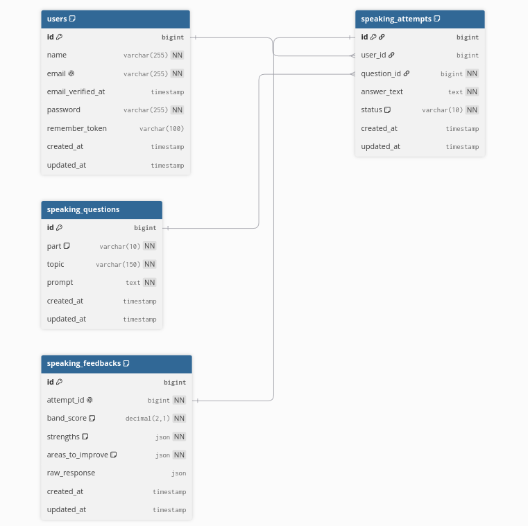

# Mini IELTS Speaking

A small full-stack app to practice IELTS Speaking in text form and receive AI-generated feedback (estimated band score, strengths, areas to improve) powered by Google Gemini.

- **Backend:** Laravel 13 (PHP 8.4), SQLite
- **AI:** Google Gemini via Laravel's `Http` client, isolated behind a service interface
- **Frontend:** Vue 3 (`<script setup>`) + Vite, served from a single Blade entry — no separate frontend server
- **Testing:** PHPUnit, `Http::fake()` for all Gemini calls (the suite runs fully offline)

## Features

- Browse IELTS Speaking practice questions (Parts 1–3), filterable by part
- Submit a written answer and get an evaluation in one request
- Dashboard with a Practice tab and a History tab (list + full detail per attempt)
- Attempt status always accurate (`pending → evaluated | failed`); a failed evaluation still leaves a visible row

## Requirements

- PHP 8.4 + Composer
- Node.js 20.19+ and npm
- A Google Gemini API key (only needed for live evaluations — not for tests)

## Setup

```bash
# 1. Install dependencies
composer install
npm install

# 2. Configure environment
cp .env.example .env
php artisan key:generate

# 3. Create the SQLite database
touch database/database.sqlite

# 4. Migrate and seed sample questions
php artisan migrate --seed

# 5. Add Gemini API key to .env
```

## Run

```bash
composer run dev
```

This starts Laravel (`http://localhost:8000`) and Vite together. Open **http://localhost:8000** in your browser.

Alternatively, run them separately in two terminals:

```bash
php artisan serve
npm run dev
```

## Environment variables

All keys live in `.env` (git-ignored). `.env.example` ships with every key present and every secret value **empty**.

| Variable | Purpose | Required |
|---|---|---|
| `APP_KEY` | Laravel app key (`php artisan key:generate`) | yes |
| `DB_CONNECTION` | `sqlite` for local dev/test | yes (default) |
| `GEMINI_API_KEY` | Google Gemini credential — **never commit this** | only for live evaluations |
| `GEMINI_MODEL` | Model name | no (default `gemini-3.1-flash-lite`) |
| `GEMINI_BASE_URL` | Gemini API base URL | no (default `https://generativelanguage.googleapis.com/v1beta`) |
| `GEMINI_TIMEOUT` | HTTP timeout in seconds | no (default `30`) |
| `SANCTUM_TOKEN_EXPIRATION` | API token lifetime in minutes | no (default `10080` — 7 days) |

> Without `GEMINI_API_KEY`, submitting an answer returns a controlled `502` response and the attempt is saved with `status: "failed"`. The dashboard and all other endpoints work fine without a key.

## Tests

```bash
php artisan test
```

The full suite runs **offline**: every Gemini call is faked with `Http::fake()`, so no API key or network access is needed. Tests use an in-memory SQLite database.

## API

See **[docs/api-docs.md](docs/api-docs.md)** for example requests/responses for every endpoint.

| Method | Path | Auth | Description |
|---|---|---|---|
| `POST` | `/api/auth/register` | none | Register and receive an API token |
| `POST` | `/api/auth/login` | none | Log in and receive an API token |
| `POST` | `/api/auth/logout` | required | Revoke the current token |
| `GET` | `/api/speaking/questions` | none | List questions (optional `?part=part1\|part2\|part3`) |
| `POST` | `/api/speaking/submit` | required | Submit an answer, receive evaluation |
| `GET` | `/api/speaking/attempts` | required | Paginated attempt history (own attempts only) |
| `GET` | `/api/speaking/attempts/{id}` | required | Attempt detail with feedback (own attempts only) |

Authenticated requests use `Authorization: Bearer <token>` (Laravel Sanctum API tokens).

All responses use a standard envelope: `{ "success": bool, "data": ..., "message": "..." }` (errors: `{ "success": false, "message": "...", "errors": {...} }`).

## Database schema

See **[docs/database-schema.md](docs/database-schema.md)** (and `docs/database.dbml` for dbdiagram.io).




Three core tables: `speaking_questions` (1) → (N) `speaking_attempts` (1) → (1) `speaking_feedbacks`, with `speaking_attempts.user_id` FK to `users` (nullable in the schema; always set server-side for new attempts).

## Deployment

This project is not deployed as part of the assessment. For the record, deploying it to a VPS or shared hosting follows the usual Laravel routine:

1. Clone the repo on the server and run `composer install --no-dev --optimize-autoloader`.
2. Copy `.env`, set `APP_ENV=production`, `APP_DEBUG=false`, and a real `GEMINI_API_KEY`; run `php artisan key:generate`.
3. Point the web server's document root at `public/` (on shared hosting, symlink or copy `public/` into `public_html`).
4. Run `php artisan migrate --force --seed`, then `php artisan config:cache route:cache view:cache`.
5. Build the frontend with `npm ci && npm run build` (locally or on the server) and deploy `public/build`.
6. Make `storage/` and `bootstrap/cache/` writable by the web server user, and serve over HTTPS.

## Architecture notes

- All Gemini access goes through `App\Services\Contracts\EvaluationServiceInterface` → `GeminiEvaluationService`; controllers never call Gemini directly.
- All validation lives in Form Request classes (`app/Http/Requests`).
- Errors on `/api/*` never leak framework internals — validation, 404, 401, evaluation failures, and any unexpected exception all return the standard error envelope, even with `APP_DEBUG=true`.
- Rate limits: `POST /api/speaking/submit` 10/min (abusive/expensive Gemini calls), `/api/auth/{register,login}` 5/min, `GET /api/speaking/questions` 60/min.
